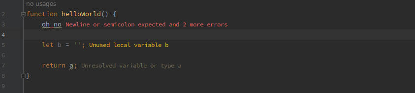
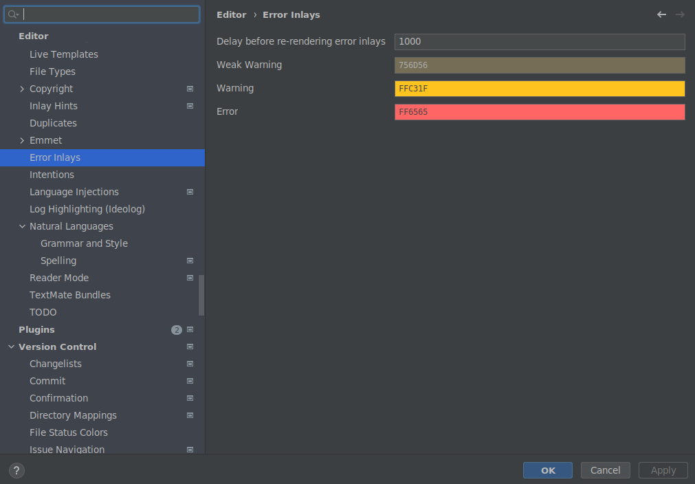

# Error Inlays

Error Inlays is a plugin for JetBrains IDEs that renders after-line inlay elements,
containing the description of one or more errors in that line.

This plugin is currently not (yet) published on the plugin marketplace.

## Customization

It is possible to configure the colors used in the inlay errors.

## Building and installing

Simply run `./gradlew buildPlugin`.
Install the plugin by opening the Plugins section in your IDE's settings modal
and selecting "Install plugin from disk" after clicking the cogwheel.
Navigate to build/distributions and select the generated ZIP file.

## RTL support

This plugin has no explicit RTL support. 
Contributions in this area are welcomed.
